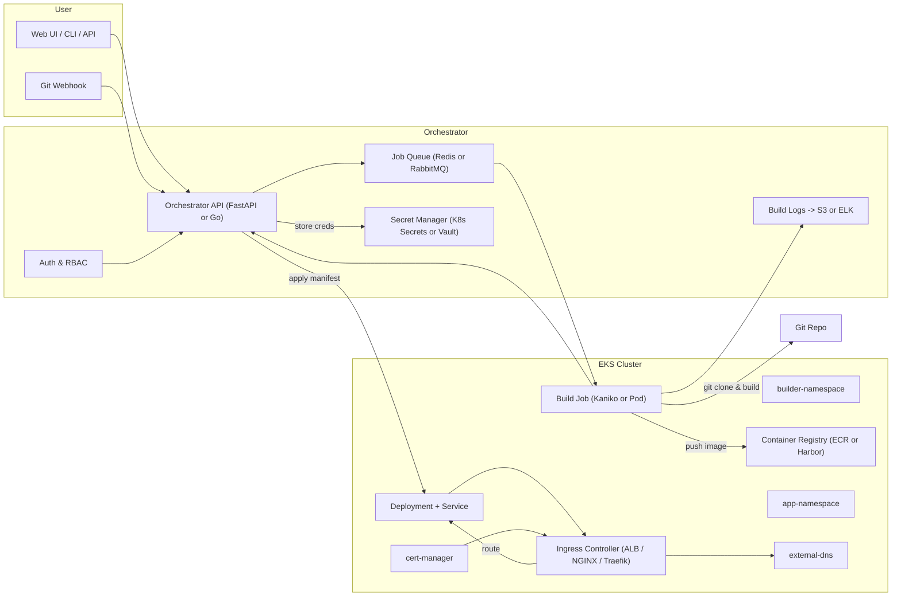

# 🚀 Mini-Vercel on EKS — Architecture & Implementation Guide
## Overview
This platform allows your dev team to deploy POCs from a Git repo to an existing EKS cluster with minimal manual steps.
It’s similar to Vercel, but self-hosted and tailored to your infra.
----
## High-Level Architecture

